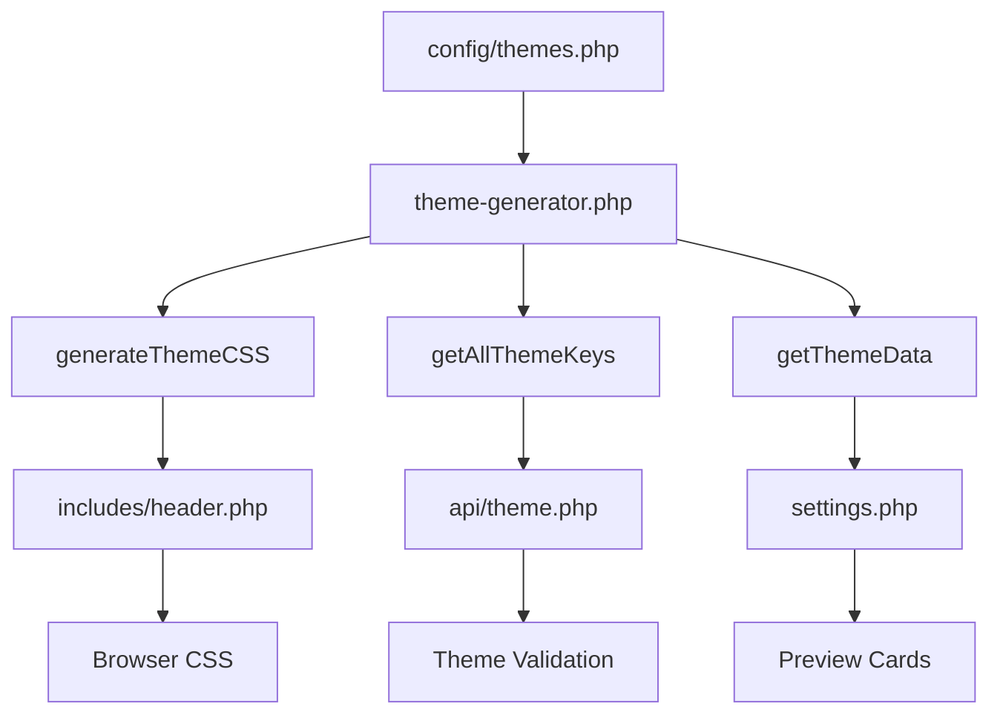

# Theme Architecture - معماری سیستم تم‌ها

## نمای کلی - Overview

ExpenseLogger از یک معماری مدرن و خودکار برای مدیریت تم‌ها استفاده می‌کند که مبتنی بر **Configuration-Driven Design** است. این معماری امکان افزودن تم‌های جدید را بدون نیاز به ویرایش چندین فایل، فراهم می‌کند.

## فلسفه طراحی - Design Philosophy

### قبل: Manual System ❌
```
برای افزودن یک تم جدید:
1. ویرایش header.php (CSS تم)
2. ویرایش settings.php (کارت پیش‌نمایش)
3. ویرایش api/theme.php (لیست تم‌های مجاز)
4. بررسی همخوانی رنگ‌ها در 3 جای مختلف
```

### بعد: Automated System ✅
```
برای افزودن یک تم جدید:
1. اضافه کردن یک آرایه به config/themes.php
   ✨ همه چیز خودکار تولید می‌شود!
```

## ساختار فایل‌ها - File Architecture

```
ExpenseLogger/
├── config/
│   ├── themes.php              # 🎯 Single Source of Truth
│   │                           # تعریف همه تم‌ها (colors, rounded, preview)
│   │
│   └── theme-generator.php     # 🏗️ CSS Generator Engine
│                               # تولید خودکار CSS و helper functions
│
├── includes/
│   └── header.php              # 📄 Auto-generated CSS
│                               # CSS از theme-generator.php تولید می‌شود
│
├── settings.php                # 🎨 Auto-generated Cards
│                               # کارت‌های پیش‌نمایش خودکار
│
└── api/
    └── theme.php               # 🔌 Theme Switch API
                                # استفاده از getAllThemeKeys()
```

## جریان داده - Data Flow



## ساختار داده - Data Structure

### config/themes.php

```php
return [
    'theme_key' => [
        // Basic Info
        'name' => 'Display Name',           // نمایش به کاربر
        'description' => 'Short description', // توضیح کوتاه
        'scheme' => 'dark|light',           // نوع طرح رنگی
        
        // Color System (DaisyUI compatible)
        'colors' => [
            // Base colors
            'base-100' => '#hexcode',       // پس‌زمینه اصلی
            'base-200' => '#hexcode',       // پس‌زمینه ثانویه
            'base-300' => '#hexcode',       // پس‌زمینه سوم
            'base-content' => '#hexcode',   // رنگ متن
            
            // Brand colors
            'primary' => '#hexcode',        // رنگ اصلی
            'primary-content' => '#hexcode', // متن روی primary
            'secondary' => '#hexcode',       // رنگ ثانویه
            'secondary-content' => '#hexcode',
            'accent' => '#hexcode',          // رنگ تاکید
            'accent-content' => '#hexcode',
            
            // Semantic colors
            'neutral' => '#hexcode',
            'neutral-content' => '#hexcode',
            'info' => '#hexcode',
            'info-content' => '#hexcode',
            'success' => '#hexcode',
            'success-content' => '#hexcode',
            'warning' => '#hexcode',
            'warning-content' => '#hexcode',
            'error' => '#hexcode',
            'error-content' => '#hexcode',
        ],
        
        // Rounded Corners System
        'rounded' => [
            'box' => '1rem',     // کارت‌ها و container ها
            'btn' => '0.5rem',   // دکمه‌ها
            'badge' => '1rem',   // نشان‌ها
        ],
        
        // Special Effects (optional)
        'glow' => false,     // افکت نئونی (فقط برای تم neon)
    ]
];
```

## توابع اصلی - Core Functions

### 1. generateThemeCSS()
```php
// تولید کامل CSS برای همه تم‌ها
function generateThemeCSS(): string
```

**خروجی:**
```css
[data-theme="light"] {
    --color-base-100: #ffffff;
    --color-primary: #3b82f6;
    --rounded-box: 1rem;
    /* ... */
}

[data-theme="sunset"] {
    /* ... */
}
```

**استفاده در header.php:**
```php
<?php
require_once __DIR__ . '/../config/theme-generator.php';
echo generateThemeCSS();
?>
```

### 2. getAllThemeKeys()
```php
// دریافت لیست تمام کلیدهای تم
function getAllThemeKeys(): array
```

**خروجی:**
```php
['light', 'sunset', 'midnight', 'forest', ...]
```

**استفاده در api/theme.php:**
```php
$allowedThemes = getAllThemeKeys();
if (!in_array($theme, $allowedThemes)) {
    // Invalid theme
}
```

### 3. getThemeData()
```php
// دریافت اطلاعات یک تم خاص
function getThemeData(string $themeKey): ?array
```

**استفاده:**
```php
$themeInfo = getThemeData('midnight');
echo $themeInfo['name'];        // "Midnight"
echo $themeInfo['description']; // "Deep & mysterious"
```

## Auto-generation در settings.php

```php
<?php
// Load themes configuration
require_once __DIR__ . '/config/theme-generator.php';
$themes = require __DIR__ . '/config/themes.php';

// Auto-generate theme cards
foreach ($themes as $themeKey => $theme):
    $colors = $theme['colors'];
    $rounded = $theme['rounded'];
    
    // Generate gradient from actual theme colors
    $gradient = "linear-gradient(135deg, {$colors['base-100']} 0%, {$colors['base-200']} 50%, {$colors['base-300']} 100%)";
    
    // Calculate rounded class dynamically
    $roundedVal = floatval(str_replace('rem', '', $rounded['box']));
    if ($roundedVal >= 2.5) $roundedClass = 'rounded-3xl';
    elseif ($roundedVal >= 2) $roundedClass = 'rounded-2xl';
    // ...
    
    // Check for glow effect
    $hasGlow = isset($theme['glow']) && $theme['glow'];
    
    // Generate card HTML
    ?>
    <label class="theme-card cursor-pointer">
        <input type="radio" name="theme-setting" value="<?php echo $themeKey; ?>" />
        <div class="card <?php echo $roundedClass; ?>" 
             style="background: <?php echo $gradient; ?>; border-color: <?php echo $colors['primary']; ?>">
            <!-- Auto-generated content using actual theme colors -->
        </div>
    </label>
    <?php
endforeach;
?>
```

## ویژگی‌های پیشرفته - Advanced Features

### 1. Rounded Corners Mapping

```php
'rounded' => ['box' => '2.5rem']  →  'rounded-3xl'
'rounded' => ['box' => '2rem']    →  'rounded-2xl'
'rounded' => ['box' => '1rem']    →  'rounded-xl'
'rounded' => ['box' => '0.5rem']  →  'rounded-md'
'rounded' => ['box' => '0rem']    →  'rounded-none'
```

### 2. Glow Effects (Neon Theme)

```php
'glow' => true,  // فعال‌سازی افکت
```

**نتیجه:**
```css
box-shadow: 0 0 25px rgba(0, 255, 136, 0.4);
text-shadow: 0 0 10px rgba(0, 255, 136, 0.5);
```

### 3. OKLch Color Space

```php
'primary' => 'oklch(74.703% 0.158 39.947)',  // فرمت پیشرفته رنگ
```

## Session Management

```php
// Initialize theme
if (!isset($_SESSION['theme'])) {
    $_SESSION['theme'] = 'light';
}

// Apply theme to HTML
<html data-theme="<?php echo $_SESSION['theme']; ?>">
```

## API Endpoint

**POST** `/api/theme.php`

```json
{
    "theme": "midnight"
}
```

**Response:**
```json
{
    "success": true,
    "theme": "midnight"
}
```

**Validation:**
```php
$allowedThemes = getAllThemeKeys();
if (!in_array($theme, $allowedThemes)) {
    http_response_code(400);
    echo json_encode(['error' => 'Invalid theme']);
    exit;
}
```

## مزایای این معماری - Benefits

✅ **Single Source of Truth**: همه اطلاعات تم در یک فایل  
✅ **Auto-generation**: CSS و UI خودکار تولید می‌شوند  
✅ **Type Safety**: ساختار ثابت و قابل پیش‌بینی  
✅ **Maintainability**: نگهداری آسان و سریع  
✅ **Consistency**: رنگ‌های یکسان در همه جا  
✅ **Scalability**: افزودن تم جدید در 2 دقیقه  

## مثال: افزودن تم جدید

```php
// فقط در config/themes.php اضافه کنید:

'cyberpunk' => [
    'name' => 'Cyberpunk',
    'description' => '2077 vibes',
    'scheme' => 'dark',
    'colors' => [
        'base-100' => '#0a0e1a',
        'primary' => '#ff0080',
        'secondary' => '#00ffff',
        // ... complete colors
    ],
    'rounded' => [
        'box' => '0rem',
        'btn' => '0rem',
        'badge' => '0rem',
    ],
    'glow' => true,
],
```

**نتیجه:**
- ✅ CSS تم در header.php اضافه شد
- ✅ کارت پیش‌نمایش با رنگ‌های واقعی تم ساخته شد
- ✅ تم در API قابل انتخاب است
- ✅ rounded corners صحیح اعمال شد
- ✅ افکت glow فعال است

## Testing Checklist

برای هر تم جدید:

- [ ] رنگ‌ها contrast کافی دارند
- [ ] پیش‌نمایش با تم واقعی مطابقت دارد
- [ ] rounded corners به درستی اعمال شده
- [ ] تم در API قابل انتخاب است
- [ ] تم در مرورگر صحیح نمایش داده می‌شود
- [ ] session تم را ذخیره می‌کند

## Performance Notes

- CSS همه تم‌ها یکجا تولید می‌شود (Single HTTP request)
- تم انتخابی در session ذخیره می‌شود (سریع)
- تعویض تم فقط یک API call (AJAX)
- بدون reload صفحه (`document.documentElement.setAttribute`)

## دستورات توسعه - Development Commands

```bash
# Test theme generation
php -r "require 'config/theme-generator.php'; echo generateThemeCSS();"

# List all themes
php -r "require 'config/theme-generator.php'; print_r(getAllThemeKeys());"

# Get specific theme data
php -r "require 'config/theme-generator.php'; print_r(getThemeData('neon'));"
```

---

**Architecture Version:** 2.0  
**Last Updated:** 2024  
**Maintainer:** ExpenseLogger Team
